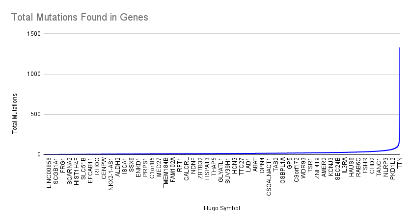
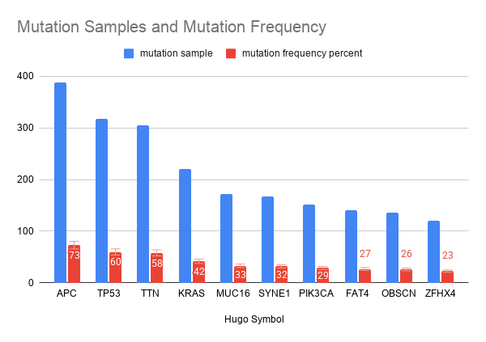
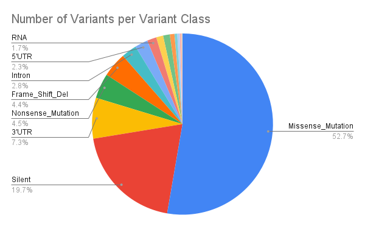

# TCGA Mutation and Clinical Outcome Analysis (SQLite)

## Overview
This project analyzes cancer mutation data from The Cancer Genome Atlas (TCGA) to explore mutation patterns, variant classifications, and clinical survival outcomes using SQL.

The analysis integrates genomic mutation data with clinical patient information to identify frequently mutated genes, variant distributions, and survival metrics.

## Dataset
- Source: The Cancer Genome Atlas (TCGA)
- Focus: Gene mutation frequency and patient clinical outcomes
- Tables used:
  - `Mutation_Data`
  - `Patient_Data`
  - `Clinical_Data`

### Key Columns

**Mutation_Data**
- `tumor_sample_barcode`
- `Hugo_Symbol`
- `Variant_Classification`
- `Variant_Type`

**Patient_Data**
- `patient_id`
- `age`
- `sex`
- `os_status`
- `os_months`

**Clinical_Data**
- `patient_id`
- `sample_id`

Clinical and mutation datasets were linked using **patient identifiers** to allow integrated genomic and clinical analysis.

## Key Questions
- Which genes have the highest mutation counts?
- What is the mutation frequency of the most commonly mutated genes?
- What variant classifications occur most frequently?
- What is the overall patient survival rate?
- Are there demographic differences in survival outcomes?

## Data Preparation
Clinical survival status values were standardized to ensure consistent analysis.  
Values representing survival outcomes were cleaned and categorized as:

- Alive
- Deceased
- Unknown

This step ensures accurate aggregation and survival calculations.

## Mutation Analysis

### Genes with the Highest Mutation Counts
This analysis identifies genes with the largest number of recorded mutations across tumor samples.

### Mutation Frequency
Mutation frequency was calculated by determining how often a gene mutation appeared across unique tumor samples.

### Variant Classification Distribution
Variant classifications were grouped to determine which mutation types are most prevalent in the dataset.

### Variant Type Counts
Variant types were analyzed to understand the distribution of genomic alterations.

## Clinical Outcome Analysis

### Average Age of Deceased Patients
Average age was calculated for deceased patients and grouped by sex to examine demographic trends.

### Linking Clinical and Genomic Data
Tumor sample identifiers were linked to patient clinical records to connect mutation data with survival outcomes.

### Survival Rate Calculation
Overall survival rate was calculated as the percentage of patients recorded as alive relative to the total number of patients.

## Tools Used
- SQLite
- Google Sheets (visualization)
- GitHub

## Data Visualizations

### Most Frequently Mutated Genes

### Mutation Frequency of Top Genes

### Variant Classification Distribution

## Key Findings
- Certain genes showed substantially higher mutation counts across tumor samples.
- Mutation classifications revealed clear patterns in the types of genomic alterations present.
- Survival analysis provided insight into patient outcomes and demographic characteristics.
- Integrating mutation data with clinical records enables deeper analysis of cancer genomics datasets.

## Skills Demonstrated
- SQL data cleaning and normalization
- Relational data analysis
- Aggregation and statistical summaries
- Data integration using joins
- Clinical and genomic data interpretation
